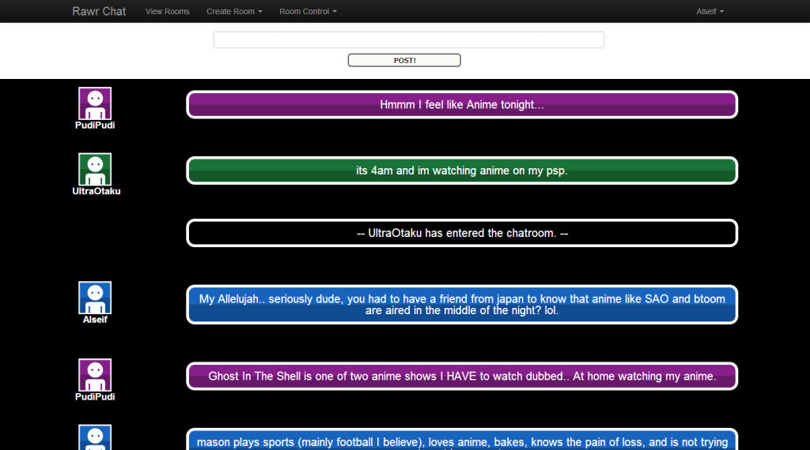
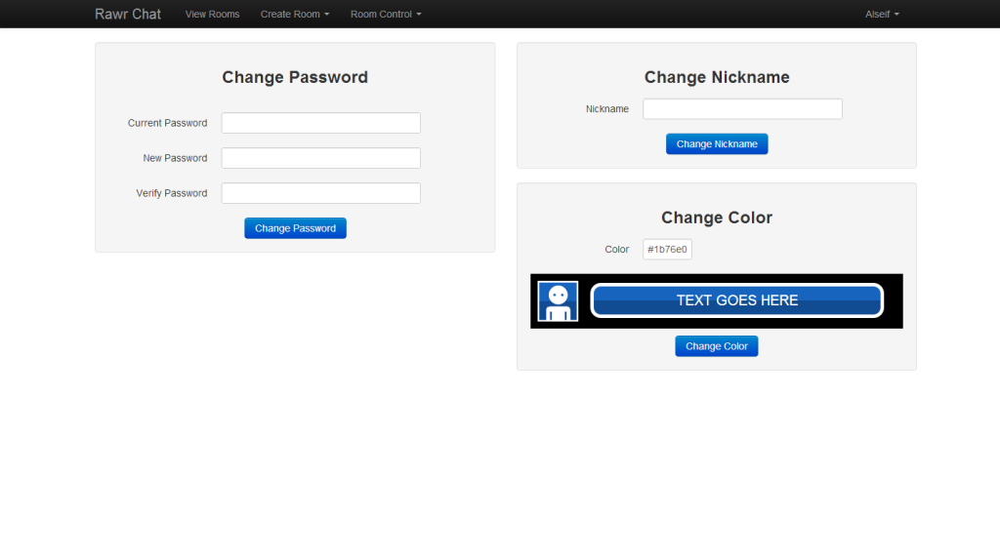

# Webchat

**Live Demo**: [http://rawrchat.juliantith.com/](http://rawrchat.juliantith.com/)

Rawr Chat is a webchat built using PHP and MySQL.  
I made this website as my final project for my PHP class in June 2012.  
I continue to update this project every once in a while. I would love to update everything and start using a MVC framework but I can't commit myself to doing that for just this small of a project.

The design for the chatroom is inspired by [Durarara!!](http://en.wikipedia.org/wiki/Durarara!!)    
I really liked the design of the chatroom from the show.  
There are similar chatrooms out there that have the same design, but I built this webchat with a focus on user customization.  
Users are currently able to select a custom color scheme for their chat bubble and avatar background.  
Custom avatars is something I would like to add in the future.  

## Screenshots

